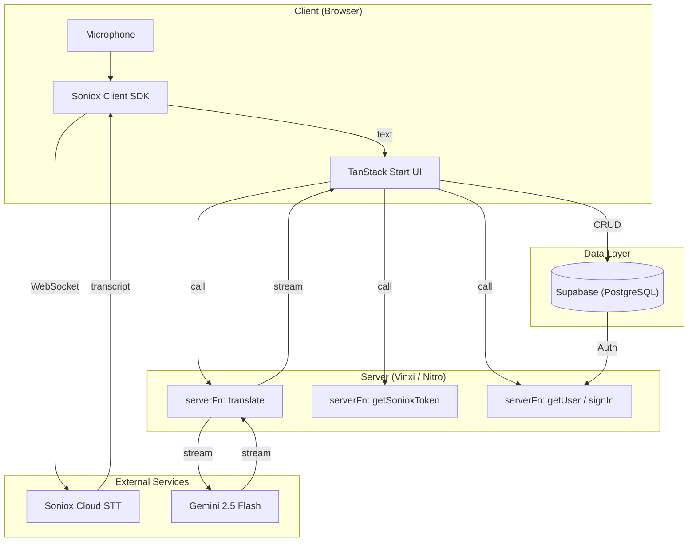

# SDD — Hey-Nabi

## 1. System Overview

Hey-Nabi is a real-time translation platform for Asian language learners. The architecture is built on TanStack Start, prioritizing type safety, explicit control, and incremental quality.



## 2. Architecture Decisions

### AD1: TanStack Start over Next.js

**Decision:** Use TanStack Start (RC) as the full-stack framework.

**Rationale:**
- End-to-end type-safe routing (auto-generated route tree)
- Explicit control — no "magic" conventions
- `createServerFn` replaces API routes with type-safe server functions
- Built on Vinxi (Vite + Nitro) — fast dev, flexible deploy
- Excellent future compatibility with Tauri (desktop)

**Trade-off:** Smaller ecosystem, RC status (not yet stable 1.0).

### AD2: Client-side STT (Soniox SDK in browser)

**Decision:** Soniox SDK runs directly in browser via WebSocket.

**Rationale:**
- Audio never touches our server → lowest latency
- No server bandwidth/CPU cost for audio streaming
- SDK handles reconnection and buffering automatically

**Trade-off:** API key must be protected via server function token endpoint.

### AD3: Server Functions for Translation

**Decision:** Translation runs via `createServerFn`, streaming response.

**Rationale:**
- Gemini API key stays secure on server
- Type-safe call from client — no manual fetch/URL building
- Streaming supported via Nitro server

### AD4: `($lang)` Optional Route Segment for i18n

**Decision:** Use TanStack Router optional path parameter for locale routing.

**Rationale:**
- No external i18n routing library needed
- Type-safe `lang` parameter in all routes
- Default locale (vi) works without prefix: `/` = `/vi/`
- SEO-friendly URL structure

## 3. Tech Stack

| Layer | Technology | Version |
|---|---|---|
| Framework | TanStack Start | RC |
| Router | TanStack Router | latest |
| Server State | TanStack Query | v5 |
| Build Engine | Vinxi (Vite + Nitro) | latest |
| Language | TypeScript | 5.x |
| Styling | Tailwind CSS | v4 |
| Components | Shadcn UI | latest |
| Client State | Zustand | v5 |
| Auth | Supabase Auth | latest |
| Database | Supabase (PostgreSQL) | latest |
| STT (real-time) | Soniox Client SDK | latest |
| STT (batch) | Groq Whisper API | latest |
| Translation | Google Gemini 2.5 Flash | latest |
| i18n | Custom `($lang)` + JSON loader | — |
| Animation | Framer Motion | v12 |

## 4. Project Structure

```
src/
├── routes/                        # File-based routing
│   ├── __root.tsx                 # Root layout (<html>, <body>, providers)
│   ├── ($lang)/                   # Optional i18n segment
│   │   ├── index.tsx              # Landing page
│   │   └── app/                   # Protected routes
│   │       ├── route.tsx          # App layout + beforeLoad auth guard
│   │       └── session/
│   │           └── index.tsx      # Live translation session
│   └── auth/
│       └── callback.tsx           # OAuth callback handler
│
├── components/
│   ├── ui/                        # Shadcn base components
│   ├── layout/                    # Header, Sidebar
│   ├── session/                   # TranscriptPanel, TranslationPanel
│   └── shared/                    # Loading, Error, Empty states
│
├── features/
│   ├── stt/
│   │   ├── hooks/use-soniox.ts    # Soniox SDK hook
│   │   └── types.ts
│   └── translation/
│       ├── hooks/use-translation.ts
│       ├── prompts.ts             # Gemini system prompts
│       └── types.ts
│
├── server/                        # Server functions (createServerFn)
│   ├── auth.ts                    # getUser, signIn, signOut
│   ├── translate.ts               # translateText (streaming)
│   └── stt.ts                     # getSonioxToken
│
├── lib/
│   ├── supabase/                  # Client + Server clients
│   ├── i18n/                      # Locale detection, message loader
│   └── utils.ts                   # cn() helper
│
├── stores/
│   ├── session-store.ts           # Active session state
│   └── ui-store.ts                # UI preferences
│
├── styles/
│   └── globals.css                # Tailwind v4 imports
│
├── messages/                      # i18n strings (split by namespace)
│   ├── vi/common.json
│   ├── en/common.json
│   ├── ko/common.json
│   ├── zh/common.json
│   └── ja/common.json
│
├── types/index.ts                 # Global TypeScript types
├── router.tsx                     # createRouter config
├── client.tsx                     # Browser entry (hydration)
└── ssr.tsx                        # Server entry (SSR)
```

## 5. Database Schema

```sql
-- User preferences
CREATE TABLE profiles (
  id UUID PRIMARY KEY REFERENCES auth.users(id) ON DELETE CASCADE,
  display_name TEXT,
  default_source_lang TEXT DEFAULT 'ko',
  default_target_lang TEXT DEFAULT 'vi',
  created_at TIMESTAMPTZ DEFAULT now(),
  updated_at TIMESTAMPTZ DEFAULT now()
);

-- Translation sessions
CREATE TABLE sessions (
  id UUID PRIMARY KEY DEFAULT gen_random_uuid(),
  user_id UUID NOT NULL REFERENCES auth.users(id) ON DELETE CASCADE,
  title TEXT,
  source_lang TEXT NOT NULL,
  target_lang TEXT NOT NULL,
  audio_source TEXT DEFAULT 'mic',
  status TEXT DEFAULT 'active',
  created_at TIMESTAMPTZ DEFAULT now(),
  ended_at TIMESTAMPTZ
);

-- Individual utterances
CREATE TABLE utterances (
  id UUID PRIMARY KEY DEFAULT gen_random_uuid(),
  session_id UUID NOT NULL REFERENCES sessions(id) ON DELETE CASCADE,
  sequence_num INTEGER NOT NULL,
  original_text TEXT NOT NULL,
  translated_text TEXT,
  is_final BOOLEAN DEFAULT false,
  timestamp_ms BIGINT,
  created_at TIMESTAMPTZ DEFAULT now()
);

-- Row Level Security
ALTER TABLE profiles ENABLE ROW LEVEL SECURITY;
ALTER TABLE sessions ENABLE ROW LEVEL SECURITY;
ALTER TABLE utterances ENABLE ROW LEVEL SECURITY;

CREATE POLICY "Users own profiles" ON profiles
  FOR ALL USING (auth.uid() = id);

CREATE POLICY "Users own sessions" ON sessions
  FOR ALL USING (auth.uid() = user_id);

CREATE POLICY "Users own utterances" ON utterances
  FOR ALL USING (
    session_id IN (SELECT id FROM sessions WHERE user_id = auth.uid())
  );
```

## 6. Server Functions

| Function | File | Input | Output | Service |
|---|---|---|---|---|
| `translateText` | `server/translate.ts` | `{text, sourceLang, targetLang}` | Streaming text | Gemini |
| `getSonioxToken` | `server/stt.ts` | — | `{token}` | Soniox |
| `getUser` | `server/auth.ts` | — | `User \| null` | Supabase |
| `signOut` | `server/auth.ts` | — | Redirect | Supabase |

## 7. Related

- Implements: [[PRD-HeyNabi]]
- Phases: [[Roadmap]]
- Flows: [[Sequence-RealtimeSession]], [[Sequence-FileUpload]]
