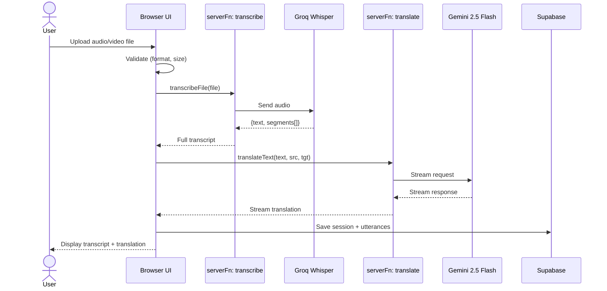

# Sequence: File Upload

## Notes

- **Max file size:** 25MB (Groq limit)
- **Supported formats:** mp3, mp4, m4a, wav, webm
- **Groq Whisper:** ~228x real-time speed
- **Translation:** runs after full transcript is ready
