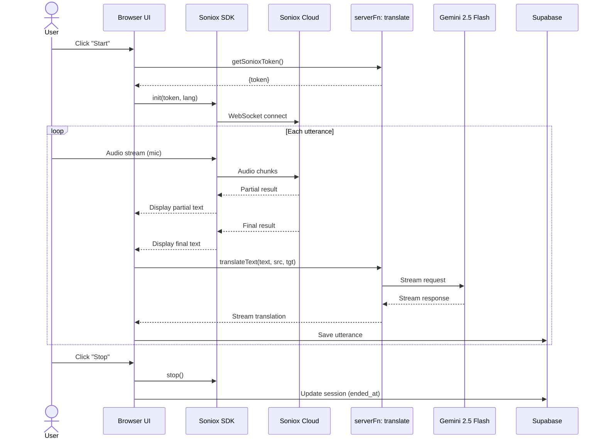

# Sequence: Real-time Session

## Notes

- **Soniox SDK** runs in browser, connects directly to Soniox Cloud
- **Token** fetched via server function to protect API key
- **Translation** runs in parallel with STT — doesn't wait for full paragraph
- **Save** happens after each final utterance
